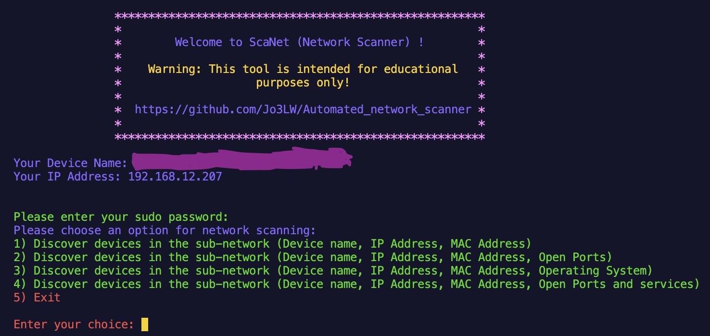
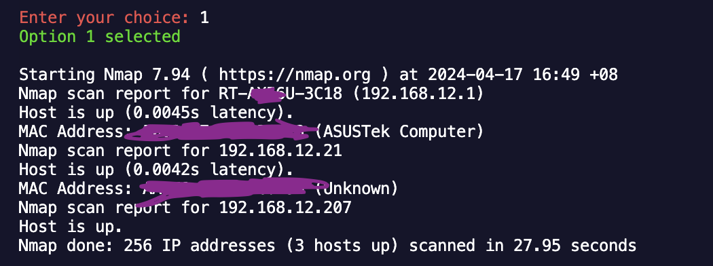
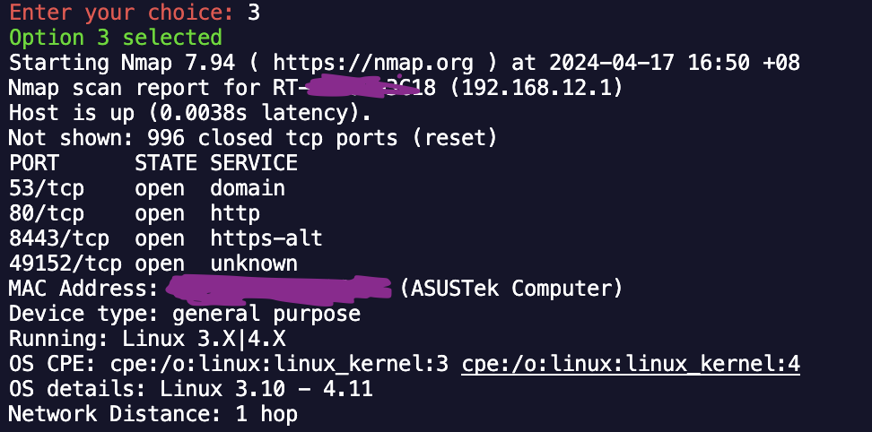
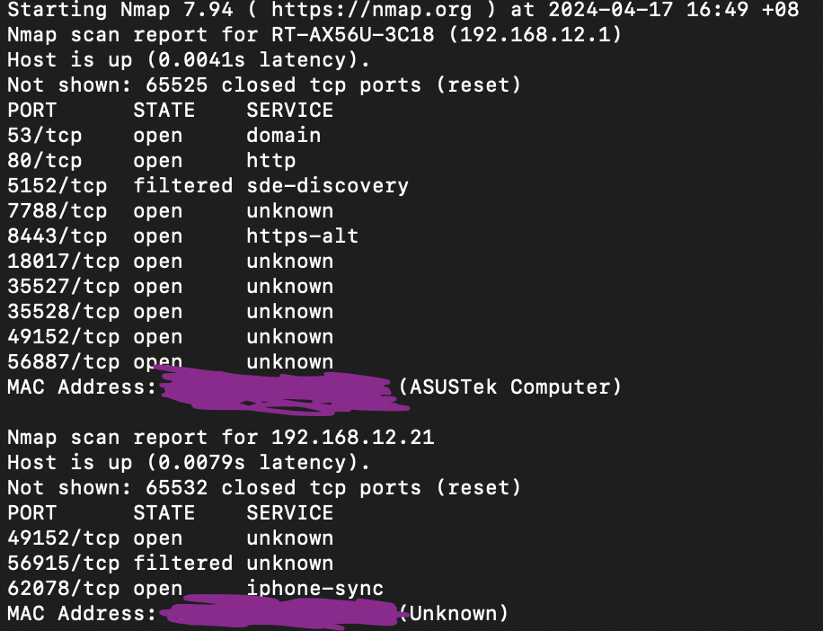
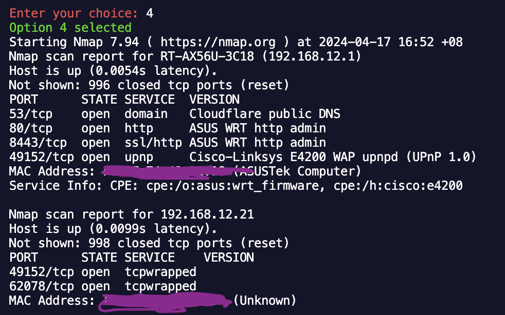

<div style="text-align: center;">
    
</div>


# ScaNet: Your Personal Network Scanning Tool 🌐




## Introduction

ScaNet is a Python-based network scanning tool designed for educational purposes. It provides a user-friendly interface for scanning local networks, discovering devices, and gathering information about IP addresses, MAC addresses, open ports, and operating systems.


Features

- Scans local networks to discover devices
- Displays device name, IP address, MAC address, and open ports
- Detects operating systems
- Provides options for custom scanning

Usage

1. Run the script and enter your sudo password
2. Choose from the scanning options:
    - Discover devices (IP address, MAC address)
    
    - Discover devices (IP address, MAC address, open ports)
    
    - Discover devices (IP address, MAC address, operating system)
    
    - Discover devices (IP address, MAC address, open ports, and services)
    
3. The script will execute the chosen scan and display the results

## Requirements

- Python 3.x
- Nmap (installed and configured)
- Sudo privileges

## Limitations

- This tool is intended for educational purposes only
- Use at your own risk

## Installation
Ensure that you have Python 3.x and Nmap installed on your system before running the script.

```bash
git clone https://github.com/Jo3LW/Automated_network_scanner.git
cd Automated_network_scanner
python3 script.py
```
